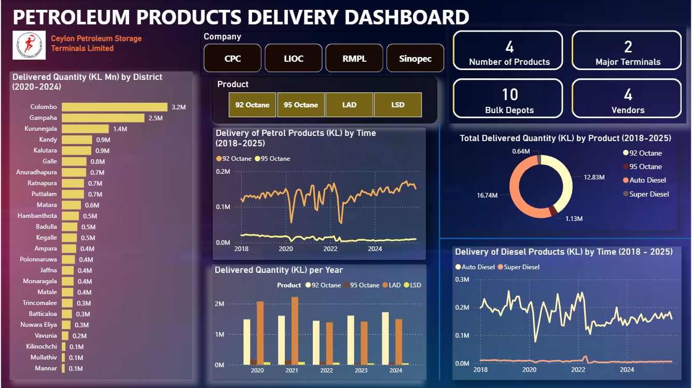

# Historical Data Analysis of Petroleum Products Deliveries – Sri Lanka

##  Overview

This project analyzes petroleum product distribution across Sri Lanka using an interactive Power BI dashboard built with SAP ERP and operational data.

##  Dashboard Preview

## 🔍 Key Insights

* Fuel distribution dropped during COVID-19 and 2022 economic crisis
* Diesel has not yet recovered to previous levels
* Distribution varies across districts

##  Tools Used

* Power BI
* SAP ERP Data

